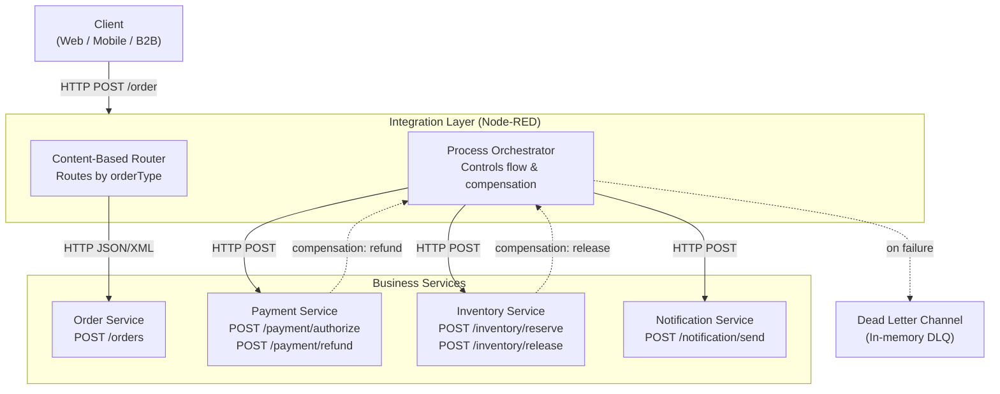
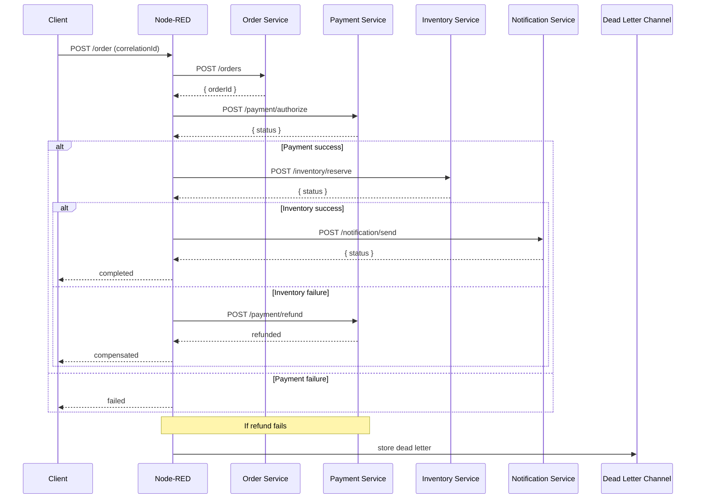
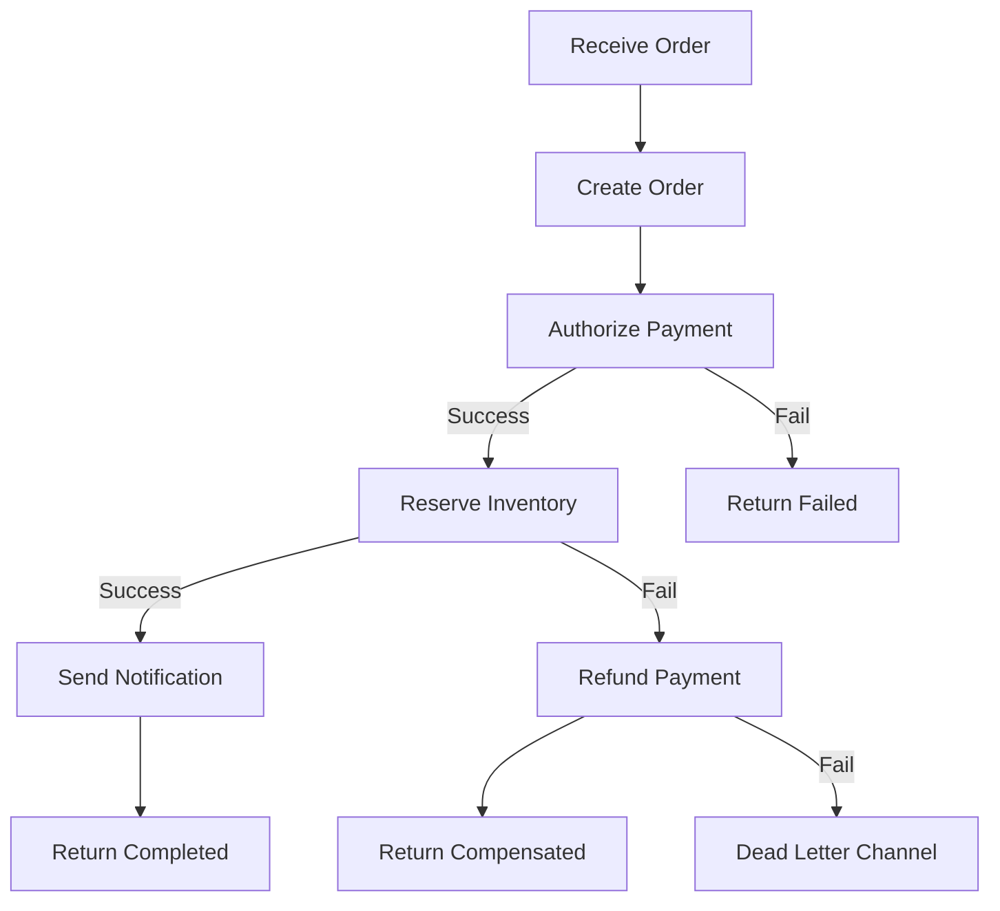

# Enterprise Application Integration Capstone


## 1. Overview

This project implements an enterprise integration solution for an e-commerce system using Node-RED orchestration and Enterprise Integration Patterns (EIP).
The system coordinates multiple independent services:

- Order Service
- Payment Service
- Inventory Service
- Notification Service
- Node-RED (integration layer)

The goal is to process customer orders reliably, including handling failures and compensating completed steps.

---

## 2. Architecture Decision
I chose Option A — Node-RED as the entry point.

Flow:

Client → Node-RED → Order Service → Payment → Inventory → Notification → Response

### Why this approach:
- Centralized orchestration logic
- Clear visibility of process flow
- Easier implementation of EIP patterns
- Simplified failure handling and compensation logic

---

## 3. System Context Diagram

---

## 4. Integration Architecture Diagram

---

## 5. Orchestration Flow

---

## 6. Pattern Mapping Table

| Pattern | Problem It Solves | Where Applied | Why Chosen |
|---|---|---|---|
| Content-Based Router |Different order formats (standard / express / b2b) |Node-RED routing logic |To route requests based on orderType |
| Correlation Identifier |Tracking order across services |correlationId in all messages |Enables traceability |
| Dead Letter Channel |Handling unrecoverable failures |Error Handling flow + DLQ endpoint |Prevent message loss |
| Request-Reply |Synchronous communication between services |HTTP request nodes|Simple orchestration |
| Message Translator |Different input formats (JSON / XML) |Normalize nodes|Unified canonical model |

---

## 7. Business Process
1. Customer places an order
2. Order is stored in Order Service
3. Payment is authorized
4. Inventory is reserved
5. Notification is sent
6. Final response returned

---

## 8. Failure Handling & Compensation


### Scenario 1 — Payment Rejection
- Payment returns rejected
- Flow stops immediately
- Inventory and Notification are NOT called
- **Result:** `status: "failed"`

### Scenario 2 — Inventory Unavailable (triggers compensation)
- Payment succeeds
- Inventory fails
- Compensation is triggered
- **Compensation logic:** Refund payment
- **Result:** `status: "compensated"`

### Dead Letter Channel
If compensation fails (e.g., refund fails):
- Message is stored in deadLetterQueue
- **Accessible via::** GET /dead-letters
This ensures no message is lost and can be manually inspected.

---

## 9. Observability

### Trace endpoint (Returns the full lifecycle trace of an order, including all steps and compensation actions)

```http
GET /trace/:orderId
{
  "orderId": "ord-123",
  "trace": [
    { "step": "intake", "status": "success" },
    { "step": "order", "status": "success" },
    { "step": "payment", "status": "success" },
    { "step": "inventory", "status": "failed" },
    { "step": "compensation:payment-refund", "status": "success" }
  ]
}
```

## 10. How to Run

### Prerequisites
- Docker Desktop installed and running
- Git

### Start the system

```bash
#1.
docker compose up -d --build

# 2. check services
curl http://localhost:1880/health     # Node-RED
curl http://localhost:3001/health     # Order Service
curl http://localhost:3002/health     # Payment Service
curl http://localhost:3003/health     # Inventory Service
curl http://localhost:3004/health     # Notification Service
```

### Testing

```bash
# Happy path
curl -X POST http://localhost:1880/order \
  -H "Content-Type: application/json" \
  -d @test-data/web-order.json

# B2B XML
curl -X POST http://localhost:1880/order \
  -H "Content-Type: text/xml" \
  -d @test-data/b2b-order.xml

# Payment failure
Set:
INVENTORY_FAIL_MODE=always

# DLQ test. Break refund endpoint and run order, then

curl http://localhost:1880/dead-letters
```

## 11. AI Usage Disclosure

AI tools were used to:

- understand Node-RED patterns
- generate initial flow logic
- assist with debugging and architecture refinement

All implementations were manually reviewed, tested, and adapted.

---

## 12. Notes

- No shared database between services
- All communication via HTTP APIs
- Correlation ID propagated through all services
- Compensation follows reverse order principle
